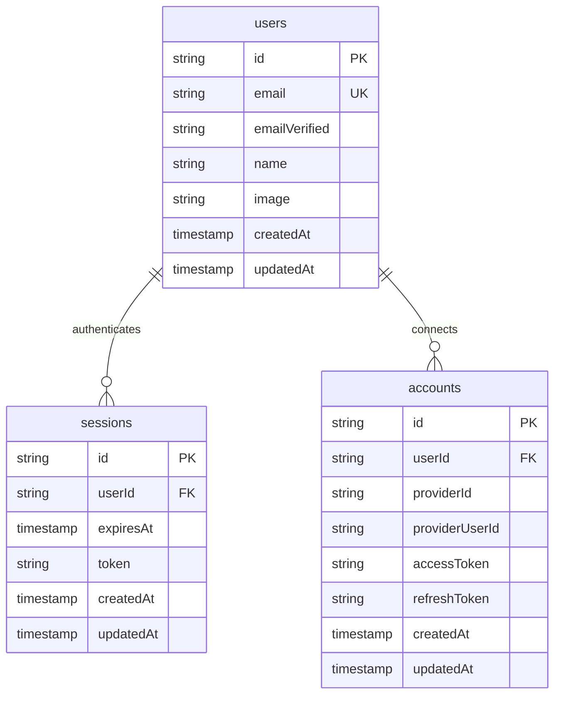
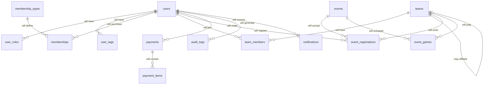

# Database Schema & Relationships

## Overview

The Quadball Canada platform uses PostgreSQL with Drizzle ORM for type-safe database operations. The schema is designed for extensibility, audit trails, and performance at scale.

> ⚠️ **Current vs Future**: Only the Better Auth tables (users, sessions, accounts) are currently implemented. All other tables shown below are **planned future entities**.

## Entity Relationship Diagram

### Currently Implemented (Better Auth)




### Future Entities (Planned)



## Schema Design Principles

These principles guide both current and future development:

### 1. Extensibility via JSONB

Strategic use of JSONB fields for flexibility:

```typescript
// Future user privacy settings
privacySettings: {
  showEmail: boolean;
  showPhone: boolean;
  showBirthYear: boolean;
}

// Future event custom fields
customFields: {
  dietaryRestrictions?: string;
  accommodationNeeds?: string;
  teamPreference?: string;
}
```

### 2. Audit Trail

Every financial transaction and sensitive operation will be logged:

```typescript
// Future payment metadata
metadata: {
  ip_address: string;
  user_agent: string;
  square_receipt_url: string;
  refund_reason?: string;
}
```

### 3. Soft Deletes

Critical data will never be hard deleted:

```typescript
// Status fields instead of deletion
status: 'active' | 'inactive' | 'cancelled' | 'expired'

// Temporal data
deactivatedAt?: Date;
deactivatedBy?: string;
```

### 4. Optimistic Concurrency

Version fields to prevent race conditions:

```typescript
// Version tracking
version: number; // Incremented on update
updatedAt: Date; // Last modification time
```

## Performance Considerations

### Current Indexes

```sql
-- User lookups (implemented)
users(email) -- Login
users(id) -- Primary key

-- Session lookups (implemented)
sessions(userId) -- User sessions
sessions(token) -- Token validation
```

### Future Indexes (When Tables Are Added)

```sql
-- Team queries
team_members(team_id, status) -- Active roster
team_members(user_id) WHERE status = 'active' -- User's team

-- Event queries
events(slug) -- URL lookups
events(start_date, status) -- Upcoming events
event_registrations(event_id, status) -- Participant lists

-- Payment queries
payments(user_id, created_at) -- User history
payments(provider_payment_id) -- Webhook lookups
```

## Data Integrity

### Current Constraints

```sql
-- Implemented in Better Auth schema
UNIQUE (email) ON users
FOREIGN KEY (userId) REFERENCES users(id) ON sessions
FOREIGN KEY (userId) REFERENCES users(id) ON accounts
```

### Future Constraints

```sql
-- One active team per user
UNIQUE (user_id) WHERE status = 'active' ON team_members

-- Unique slugs
UNIQUE (slug) ON teams
UNIQUE (slug) ON events

-- Valid price ranges
CHECK (price_cents >= 0) ON membership_types
CHECK (fee_cents >= 0) ON events
```

## Migration Strategy

### Current State

- Better Auth tables created automatically
- User authentication fully functional

### Future Migrations

All schema changes will be managed through Drizzle:

```typescript
// Generate migration
pnpm db:generate

// Apply migration
pnpm db:push

// Migration naming convention
0001_add_user_profiles.sql
0002_add_rbac_tables.sql
0003_add_team_tables.sql
0004_add_event_system.sql
0005_add_payment_tables.sql
```

## Security Considerations

### Current Implementation

- Sessions expire automatically
- Passwords hashed with bcrypt
- OAuth tokens stored securely

### Future Security Features

#### Sensitive Data Encryption

Fields requiring special handling:

- `users.phone` - Will be encrypted at rest
- `users.emergencyContact` - Encrypted JSONB
- `payments.metadata` - Contains PII
- `audit_logs.ipAddress` - Privacy regulations

#### Row-Level Security

Future access control patterns:

```typescript
// Users see own data
function canViewUser(userId: string, targetId: string) {
  return userId === targetId || hasRole(userId, "global_admin");
}

// Team members see team data
function canViewTeam(userId: string, teamId: string) {
  return isTeamMember(userId, teamId) || hasRole(userId, "team_lead");
}
```

## Next Steps

1. **Profile Extension** - Add profile fields to users table
2. **RBAC Implementation** - Create roles and permissions system
3. **Team System** - Teams and membership tables
4. **Event Management** - Events and registration system
5. **Payment Processing** - Square integration tables

The schema is designed to evolve incrementally while maintaining data integrity and performance.
